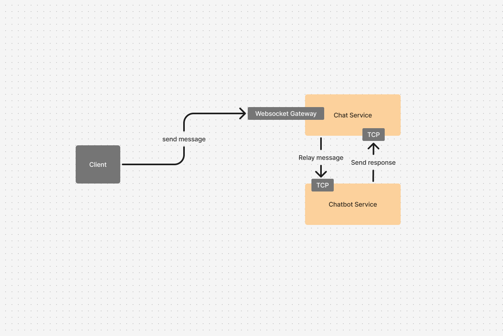

# Chat Application Prototype

  

### Architecture Diagram:

   

### To run this project using Kubernetes:

- clone this repository
- navigate to the repo's root directory
- if running locally (minikube) don't forget to run: `minikube tunnel` to create a route to services deployed with type LoadBalancer to be able to connect to them
- `kubectl apply -f k8s/services`
- `kubectl get services`
- use the `EXTERNAL-IP` value for `chat-service-external` service as the value for `CHATSERVICE_IP` in `k8s/configmaps/chat-client.configmap.yaml`
- use the `CLUSTER-IP` value for `mongo-service` service as the value for `MONGO_IP` in `k8s/configmaps/chat-service.configmap.yaml`
- `kubectl apply -f k8s/configmaps`
- `kubectl apply -f k8s/secrets`
- `kubectl apply -f k8s/deployments`
- open your browser to the `EXTERNAL_IP` value for the chat-client service `ie: http://10.102.130.124`

 

### How to use

- Errors are displayed in the top right corner in red (and dissapear after 5 seconds)
- Must enter a name before you can start chatting
- Use the start chat as button to remove the old chat from view and load chat history (if any) for the user who's name you entered
- Chat with the chat bot
- Use the "escalate" command to escalate the user's chat to the live chat service (which has not been implemented)
  - Consequent messages for this chat will receive a "Live chat not implemented yet" error
  - Since live chat has not been yet implemented, there is no option to de-escalate a chat once it has been escalated.

 

### Considerations

- Scaling the microservices up (or down) is as easy as adjusting the `Deployment`'s replicas.
  - The same applies for the frontend.
- For scaling the database we have to approaches:
  - A more brute froce-ish way, which is to create a separate `Deployment` and `Service` for each replica.
  - A more refined approach, which is to use `StatefulSets` with a headless service.
    - `StatefulSets` provide stable and persistent network identifiers and volumes.
- To maintain low latency across a global workload we might want to deploy to multiple clusters in different regions.
- Use `StorageClass`, `PersistentVolume` and `PersistentVolumeClaim` to abstracts details of how storage is provided from how it is consumed and allow for dynamic provisioning of volumes for volume claims.

 

### Design Desicions

- NodePort Services are used for services that are internal to the clutser; cannot be reached from outside the cluster.
- LoadBalancer services are used for services that should be reachable from outside of the cluster.

 

### Notes

- to get value to use in secret file: `echo "<plaintext>" | base64`
- to decode value as plain text: `echo "<base64 data>" | base64 --decode`
